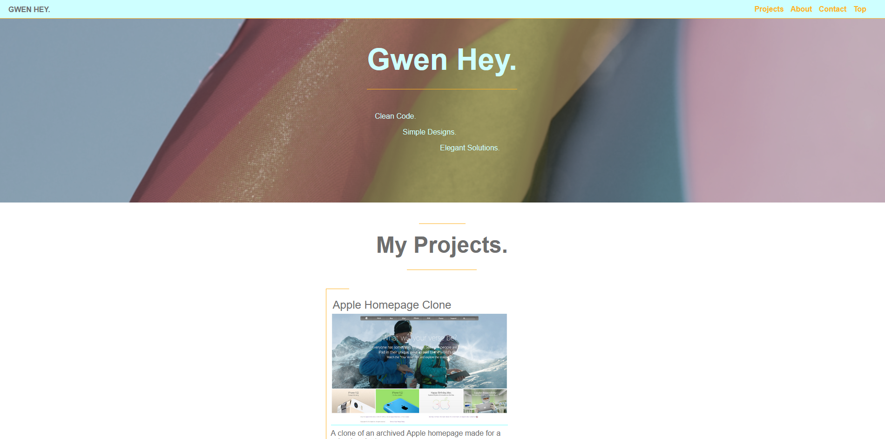

#Gwen Hey
## Table Of Contents

* [About the project](#about-the-project)
* [Technologies](#technologies)
* [Acknowledgements](#acknowledgements)
* [About me](#about-me)

## About the project

This is my portfolio!

## Technologies
<!--Add more technologies HERE-->
The technologies used were Github, VSCode, HTML/CSS, Stickler, and Styleint.

## Acknowledgements

I used refences from  W3 schools, the mozilla docs, and stackoverflow for little that's that frustrated me.

## About me

GITHUB PROFILE  
[github](https://github.com/HeyItsGwen)

LINKEDIN PROFILE  
[linkedin](https://www.linkedin.com/in/gwen-hey-642109191/)